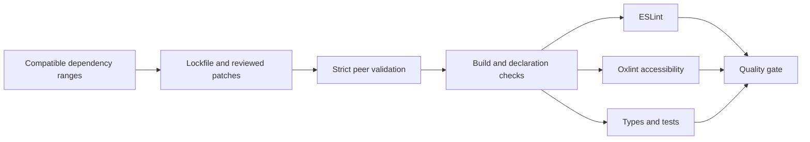

# ADR 061: 依存更新と厳格な検証

- 日付: 2026-09-17
- 状態: 採用（上流制約は下記参照）

## 背景

依存関係の強制固定が更新を妨げ、peer dependency の許容設定、型宣言検査の省略、lint 警告の成功扱いによって互換性の問題が見えにくくなっていた。

## 決定

- 安定版の直接依存を更新し、不要な完全固定は互換バージョン範囲に置き換える。lockfile は再現可能なインストールのため保持する。
- Vue 内部パッケージ、API Extractor、Babel 等の一律 override を除去する。残す override は `minimatch`、`ajv`、`lodash`、`esbuild` の脆弱な範囲への安全下限と、TSDoc プラグインが使用する TypeScript ESLint utils の互換更新、および下記 Nitro/Archiver の移行に限定する。
- `strictPeerDependencies` を有効にし、ESLint の peer mismatch を許容しない。アクセシビリティ検査は Oxlint の対応する規則に移し、ESLint 10 を維持する。以前の有効規則は維持し、フォーカス規則も有効にする。
- lint に `--max-warnings 0` を指定する。SARIF のアップロードは失敗時も可能にし、lint の失敗自体は成功に変換しない。
- `skipLibCheck` と `ignoreDeprecations` を使用せず、パッケージは依存先の公開型を参照する。Vue の生成型は公開 `vue` エントリと NodeNext で解決可能なパスに正規化する。
- `lucide-vue-next` は公式後継の `@lucide/vue` に移行する。Vitest 5 の benchmark fixture と JSON reporter に移行する。

## 互換性の制約

- TypeScript は `^6.0.3` を維持する。7.0 は従来のコンパイラ API を提供せず、typescript-eslint・TypeDoc 等の対応範囲外である。[公式説明](https://devblogs.microsoft.com/typescript/announcing-typescript-7-0/)
- Unicorn は `^64.0.0` を維持する。75 の推奨規則への全面移行は ES2024/2025 API の要求と広範な実装変更を伴うため、ES2022 を維持する本更新とは分離する。
- Nitro の Azure ZIP 出力を Archiver 8 の `ZipArchive` API に移行するパッチと、`nitropack>archiver` の限定 override を組み合わせ、非推奨の `archiver-utils` / `glob@10` を除去した。実際の ZIP 生成・展開検証と自動回帰テストで互換性を確認した。

## 上流の互換性パッチ

パッチは検査を無効化せず、具体的な型定義や API の不整合を修正する。各対象を更新した際は、上流での修正状況とパッチ除去の可否を再検証する。

| 対象                                                           | 修正                                                              |
| -------------------------------------------------------------- | ----------------------------------------------------------------- |
| tsup                                                           | 設定にない非推奨 `baseUrl` を自動挿入しない                       |
| rapid-draughts                                                 | ESM 型宣言の相対 import に拡張子を付ける                          |
| @storybook/react / @storybook/vue3 / @storybook/web-components | strict optional property 設定でメタ・ストーリーの制約を整合させる |
| @storybook/react-vite                                          | CJS/ESM 両方で docgen の関数オプション型を取得する                |
| storybook                                                      | testing-library の型 import に ESM 拡張子を付ける                 |
| @testing-library/jest-dom                                      | Vitest 5 の Assertion の型引数と非同期戻り値に対応する            |
| nitropack                                                      | Azure ZIP 出力を Archiver 8 の `ZipArchive` に移行する            |

## 検証

lint、型チェック、全体ビルド、テスト、Core coverage、benchmark、依存監査、公開型の解決を検証する。未実施・失敗した検証を成功として記録しない。

### 検証経路の補強

- SRI 更新の公開済みリソース取得失敗と文書メタデータの読取失敗は、環境変数による opt-in なしで非ゼロ終了にする。回帰テスト4件で失敗伝播、Vue 型宣言の変換、Nitro の ZIP 生成を検証する。
- 今回変更した補助スクリプトは `lint:tooling` で明示的に検査する。コミット時は ESLint が対象とするファイルを選び、警告を失敗扱いにする。
- Next.js に Tailwind 4 の PostCSS プラグインを設定し、未処理の `@theme` による CSS 警告を解消する。
- ドキュメント配信の artifact 取得にある一括の `continue-on-error` を除去する。未公開の任意 artifact が存在しない場合の明示的な警告は維持するが、通信・認証等の実エラーは成功に変換しない。

### 2026-09-17 の実測結果

- `pnpm install --frozen-lockfile`: 成功。peer dependency の許容例外は使用しない。
- `pnpm lint`: 98/98 タスク成功。アクセシビリティ・補助スクリプトも警告0件。
- `pnpm typecheck`: 99/99 タスク成功。依存ライブラリの型宣言検査を含む。
- `pnpm build`: SRI 取得と56/56タスクが成功。ビルド警告なし。
- `pnpm test`: 146ファイル・1,661テスト成功、補助スクリプトの回帰テスト3件成功。
- Core coverage: lines 98.45%、statements 97.94%、branches 89.05%、functions 94.4%。設定済み閾値を満たす。
- `pnpm audit`: 全 severity 0件。`pnpm outdated -r` の残りは上記 TypeScript / Unicorn の2種類。
- リポジトリ全体への ESLint も警告0件。CI は4GBヒープを明示する。TypeScript 設定の基準ディレクトリを JS にも指定し、生成 API ドキュメントを除外する。Registry にも lint スクリプトを追加する。
- CodeRabbit: packages と scripts を分割レビュー。スクリプトの Windows パス判定の指摘1件を修正し、回帰テストを再実行した。サービスは `completed_with_warnings` を返しており、全変更の完全な外部承認とは扱わない。
- E2E と公開・配信の実行は未実施。

- Benchmark: 単独再実行で19/19成功、警告なし。同時ビルド下での初回は1件が60秒タイムアウトしたため、成功扱いにせず全件再測定した（219.66秒）。

### ブラウザーでの検証と修正 (2026-09-18)

- Portless の現行 `apps` 設定と名前付き URL を使用する。E2E は本番ビルドを作成してから起動し、終了時には SIGINT でサーバーを停止する。ローカルの非特権プロキシでは `PORTLESS_PORT=1355` を明示する。
- ブラウザーの console warning/error と未処理例外を E2E の失敗として検出する。React 4件・Vue 5件がすべて成功した。
- ダッシュボードの初期盤面を実際の FEN/SFEN から設定する。Vue の駒名・駒表示マップは未指定時と解除時に空オブジェクトを使用し、Web Component の描画例外を防ぐ。
- 探索停止の `SEARCH_ABORTED` は型付きの正常なキャンセルとして扱う。その他の探索・停止エラーは呼び出し元へ伝播し、UI に表示する。停止処理の Promise を返し、未処理 rejection を防ぐ。
- Playwright CT の CLI は CT パッケージが提供するものを使用し、不要な `@playwright/test` の重複による実行バージョンの不一致を除去する。

### 統合前レビューと追加検証 (2026-09-26–27)

- Dependabot #250 / #251 / #255 の互換更新を統合し、Next.js 16.3.5、Vitest 5.0.2、Vue 3.5.43、ESLint 10.11.0 を採用した。TypeScript 7 と Unicorn のメジャー移行は上記の互換制約により分離する。Node.js 24 で検証するため、Node 26 向けの型定義移行も本変更に含めない。
- #254 の OSV Scanner Action コミットを取り込み、v2.6.0 の注釈へ修正した。
- CodeRabbit の初回 packages レビューで、エンジン切り替え後の遅延エラー表示を検出した。再レビューでは同一エンジンの旧操作によるエラー上書きを検出した。React/Vue 双方でエンジンと最新操作を確認し、切り替えと停止後の遅延 rejection を回帰テストで検証した。
- scripts レビューで Vue の宣言変換が通常の文字列リテラルにも及ぶ問題を検出した。変換対象を `from` / `import()` のモジュール指定に限定し、文字列リテラルを保持する回帰テストを追加した。再レビューは指摘0件。examples と .github のレビューも指摘0件。
- `pnpm lint` / `pnpm typecheck` / `pnpm build` / `pnpm test` はすべて終了コード0。単体テストは148ファイル・1,678件、補助テストは4件成功。リポジトリ全体の ESLint と doc-sync も成功した。
- Core coverage は lines 98.45%、statements 97.94%、branches 89.05%、functions 94.4%。閾値の変更は行っていない。
- `pnpm install --frozen-lockfile` 成功。更新後の `pnpm audit` は全 severity 0件。
- ベンチマークの初回実行はサンプル増加による worker のメモリ不足で失敗した。各ケースをウォームアップ1,000回・測定10,000回に統一し、メモリ増量やエラー抑制なしで19/19成功した。時間制限による可変サンプルの旧測定とは測定条件が異なるため、性能値の直接比較は行わない。
- ブラウザー E2E は React CT 64件、Vue CT 57件、React dashboard 4件、Vue dashboard 5件が成功。ダッシュボード内の console warning/error と未処理例外は0件。
- 並行ビルド時に Nuxt のプラグイン時間割合の警告が1回発生したが、E2E の単独ビルドでは再現しなかった。端末の `NO_COLOR` と Playwright の `FORCE_COLOR` の競合は、検証環境で `NO_COLOR` を解除して解消し、E2E 130件を警告なしで再確認した。
- パッチ再適用後の pre-commit で import-x の parser 解決失敗を検出した。間接依存の配置に頼らず `@typescript-eslint/parser` を直接 devDependency として宣言し、クリーンな依存配置でも検査可能にした。

### 依存更新の継続 (2026-10-01)

- Dependabot #258 の artifact download action v25 と、#260 の互換範囲内の依存更新を統合する。
- Wrangler の上流更新で `undici` 7.29.1 を導入し、`serialize-javascript` も既存の依存範囲内で修正版へ更新する。新しい override や監査の除外は追加しない。
- TypeScript 7 は最新の typescript-eslint / TypeDoc の peer 範囲外である。Unicorn 76 は既存 CI で追加規則への多数の違反が確認されており、ES2022 を維持する本更新から分離する。Node 26 型定義も Node 24 の検証環境に合わせて保留を継続する。

### 依存更新の継続 (2026-10-04)

- 10月2日の Dependabot 更新失敗は、公開後36時間の React ESLint プラグインと35時間の Next.js ESLint プラグインが `minimumReleaseAge` に拒否されたためだった。対象として報告された Node 型定義・Unicorn・TypeScript 自体の不具合ではない。待機期間の除外は追加しない。
- GitHub はこの Dependabot 実行の再試行を許可しないため、互換範囲内の依存をローカルで更新し、strict peer dependency 検査を維持して依存解決を再検証する。
- TypeScript 7 は typescript-eslint の `>=4.8.4 <6.1.0`、TypeDoc の `6.0.x` までの対応範囲外であり、引き続き別途移行が必要。Unicorn 77 と Node 26 型定義は別途検証する。Storybook 10.6.1 は5件の既存パッチを再適用して更新する。開発依存 devalue は既存の許容範囲内で修正版へ更新する。node-forge と braces は現行 npm 監査で修正版なしと報告されているため未解決として記録する。監査の除外や新しい override は追加しない。

- 未解決の開発依存: [node-forge](https://github.com/advisories/GHSA-86w9-cpqp-85rv)、[braces](https://github.com/advisories/GHSA-vfj7-8cjw-p6xm)。`pnpm audit` の失敗を成功扱いにしない。

- 最終構成の `pnpm build` は56/56タスク、`pnpm typecheck` は99/99タスクが成功。`pnpm lint`、`pnpm test`、lockfile 再インストール、doc-sync が成功した。CodeRabbit の依存更新レビューと追加パッチレビューはともに指摘0件。本番依存監査は0件、全依存監査には上記の高リスク2件が残る。E2E・リモート CI・公開は未実施。

### 2026-10-05: 未修正依存の置換

修正版のない node-forge と braces の依存経路を置き換えた。決定と保守手順は [ADR 062](062-development-tooling-security-backends.md) を参照。
