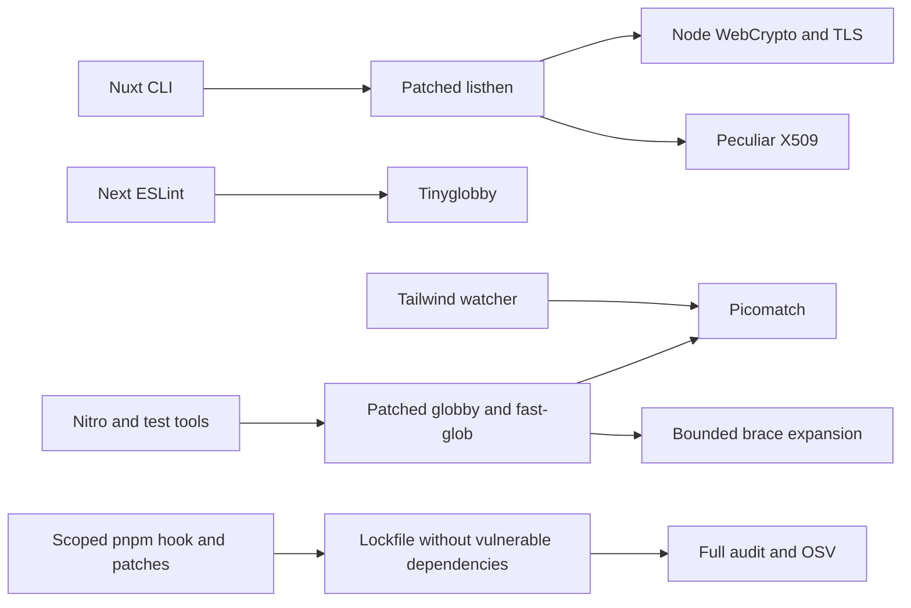

# ADR 062: 開発ツールの暗号・glob 依存置換

- 日付: 2026-10-05
- 状態: 採用

## 現在の検証状態 (2026-10-06)

PR #262 / #265 は統合済み。開発依存の監査は0件で、最新mainのCI・E2E・公開ワークフローは成功。これはChunkedDownloaderのCodeQL High警告68–70の解消を意味しない。残件と撤去条件は [保守計画](../implementation_plans/20261006-maintenance-and-roadmap.md) を参照。

## 背景

PR #262 の OSV 監査で、修正版のない `node-forge` 1.4.0 と `braces` 3.0.3 が検出された。これらは開発ツールの間接依存だが、全依存監査を失敗させる。上流の公開を待つだけでは修正が完了しないため、必要な機能を維持して依存経路を置き換える。

## 決定

- `listhen` 1.10.1 の証明書処理を Node.js の WebCrypto・TLS と `@peculiar/x509` に移行する。CJS/ESM の両方に適用し、証明書チェーン、DNS/IP SAN、暗号化 PEM、PFX を維持する。CA とサーバー証明書に異なる識別名と鍵識別子を付ける。PFX は Node.js の TLS に直接渡すため、listener の証明書型は PEM と PFX の union とする。
- `@next/eslint-plugin-next` 16.3.8 のルート検索を `tinyglobby` に移行し、絶対パス・相対パスと末尾区切りの形式を保持する。
- `fast-glob` 3.3.3、`globby` 16.2.4、`@parcel/watcher` 2.5.1 で使用する matching を `picomatch` に移行する。Fast-glob の brace 展開は `@isaacs/brace-expansion` を使い、エスケープを保持する。65,536文字・64段の入れ子・256組の括弧・10,000件の展開を超える入力は明示的なエラーにする。結果を黙って切り詰めない。
- `pnpm patch` による実装変更と `.pnpmfile.cjs` の対象名・バージョンを限定した依存変更を組み合わせる。パッチの適用だけでは依存解決の graph は変わらないため、hook が不要になった依存を除去し、実際に使用する置換ライブラリを宣言する。置換先は互換バージョン範囲、パッチ対象は検証したバージョンに限定する。
- audit/OSV の除外、成功扱いへの変換、脆弱なパッケージの別名化は行わない。lockfile に `node-forge`・`braces`・`micromatch` がないことを回帰テストで確認する。

## 検証と保守

`scripts/tooling-security.test.mjs` で、実際にインストールされた CJS/ESM の HTTPS サーバー、信頼する CA 付き TLS 通信、暗号化 PEM と PFX、誤ったパスワード、glob 検索と除外、範囲・エスケープ・過剰展開、監視の除外パターンを検証する。PFX のテスト用データはシステムの OpenSSL で一時的に生成し、秘密鍵や固定の認証情報をリポジトリに保存しない。

上流更新時はパッチと hook をセットで再検証し、上流が安全な実装へ移行したら両方を除去する。既存のブリッジライブラリの通信・SRI・公開 API は変更しない。検証結果は PR に記録し、未実施や失敗した検証を成功扱いにしない。

## 参照

- [node-forge advisory](https://github.com/advisories/GHSA-86w9-cpqp-85rv)
- [braces advisory](https://github.com/advisories/GHSA-vfj7-8cjw-p6xm)
- [Peculiar X509](https://github.com/PeculiarVentures/x509)
- [Tinyglobby](https://github.com/SuperchupuDev/tinyglobby)
- [Brace expansion](https://github.com/isaacs/brace-expansion)

2026-10-06: 新規の5件の脆弱性を修正するため simple-git >=4.0.1 <5、@simple-git/argv-parser >=2.0.1 <3、source-map-js >=1.2.2 <2 を脆弱な範囲に限定して適用する。Nuxt DevTools 3.4.2 のGitファクトリ参照を名前付きエクスポートへ更新し、branch/revparse/status の互換性を検証する。上流が安全な依存範囲へ移行した時点で override とパッチを除去する。

2026-10-07: S1/S2はshell-quote 1.11.0・sharp 0.35.5へ修正済み（統合待ち）。Next経由とWrangler→Miniflare経由のsharpを、脆弱範囲限定の `sharp@<0.35.5: >=0.35.5 <0.36` で解決した。修正ブランチのpnpm auditは0件、lint・typecheck・build・test、Changesets status、sharpのSVG→PNG変換、Wrangler起動確認は成功。CodeQL High 3件とその他の課題は未解消。 上流の安全な依存範囲採用後にsharp overrideを撤去する。
