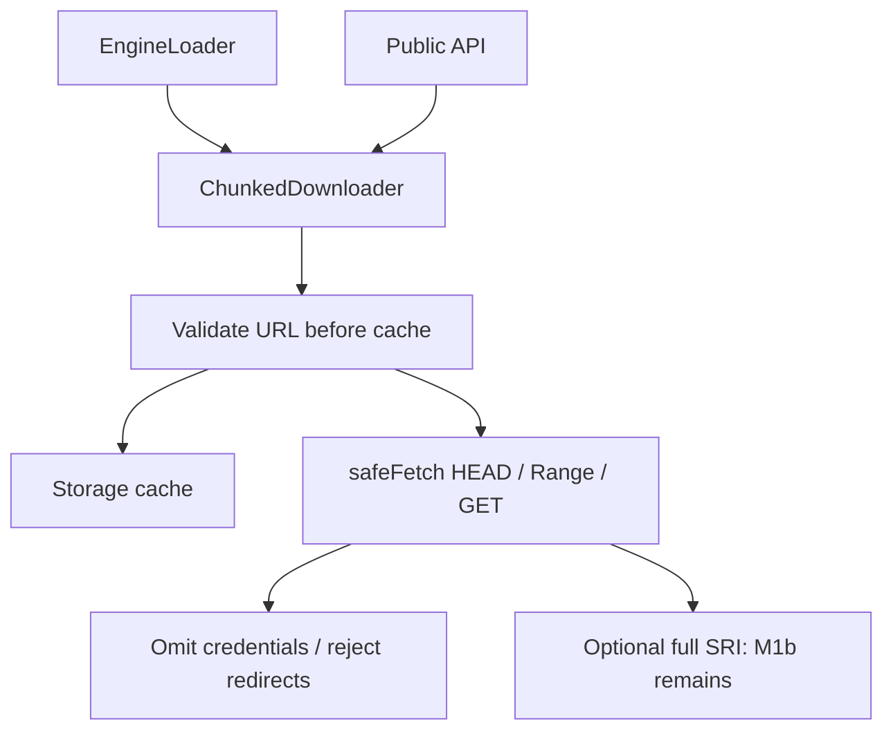
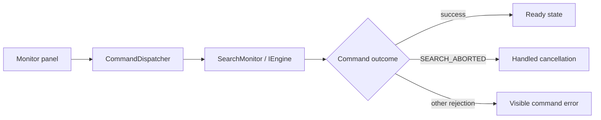
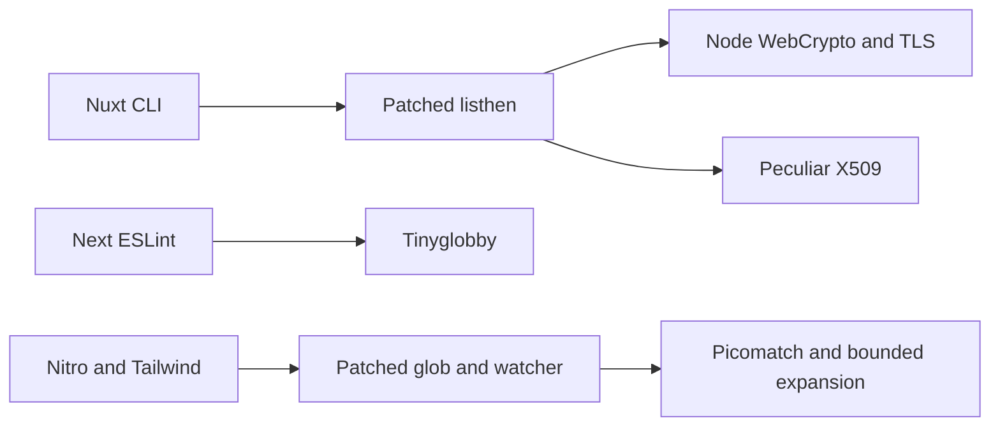

# Architecture & Design

## Transport boundary remediation (2026-10-07)

PR #268 dependency fixes are merged on main `2b6b534`; audit reports zero findings and post-merge CI, E2E, Release, docs deployment and SRI refresh passed. This change implements M1a pending integration: validate URLs before cache access; use safeFetch with credentials omit and redirect error for HEAD, Range and GET. Invalid URLs, embedded credentials and remote HTTP raise SECURITY_ERROR. HEAD security refusals and aborts do not fall back. Confirm closure of CodeQL 68–70 after integration. M1b mandatory SRI, M1c response-size contracts remain incomplete. Q1 public-API tests remove any and suppression, pending integration. This change also includes Dependabot PR #267 action-download-artifact v27.

See the [issue register](ISSUES.md) for evidence, impact, and investigation items (updated 2026-10-06).

## Current implementation and maintenance scope (2026-10-07)

PR #268 dependency fixes are merged on main `2b6b534`; audit reports zero findings and post-merge CI, E2E, Release, docs deployment and SRI refresh passed. This change implements M1a pending integration: validate URLs before cache access; use safeFetch with credentials omit and redirect error for HEAD, Range and GET. Invalid URLs, embedded credentials and remote HTTP raise SECURITY_ERROR. HEAD security refusals and aborts do not fall back. Confirm closure of CodeQL 68–70 after integration. M1b mandatory SRI, M1c response-size contracts remain incomplete. Q1 public-API tests remove any and suppression, pending integration. This change also includes Dependabot PR #267 action-download-artifact v27.

KataGo/Mortal assets have registered SRI and return HTTP 200, but are stubs. See the [execution plan](implementation_plans/20261006-maintenance-and-roadmap.md) and [current progress](PROGRESS.md) for priorities, acceptance criteria, and verified operational state.

This document explains the design principles and technical architecture of `multi-game-engines`.

## Design Principles

1.  **Pure Core (Pay-as-you-go)**:
    - The core library has zero knowledge of specific game engines or protocols.
    - **Domain Isolation**: Logic and localization resources (i18n) for specific games (Chess, Shogi, etc.) are physically isolated into dedicated packages (`domain-chess`, `i18n-chess`, etc.).
    - Users only import the modules they need, ensuring that unused code, types, and language data are never bundled.
2.  **Decentralized Type Inference (Declaration Merging)**:
    - Leverages TypeScript's declaration merging so that importing an adapter automatically enables type inference for `bridge.getEngine('id')`.
3.  **Framework Agnostic**:
    - Engine thinking information (candidate moves, scores) is delivered via `AsyncIterable`. This allows for intuitive real-time updates using `for await...of` loops.
4.  **Modern Web Standards (2026 Ready)**:
    - **OPFS (Origin Private File System)**: Used for high-speed browser-based file persistence of large WASM binaries and evaluation files (falls back to IndexedDB).
    - **WebAssembly (SIMD/Threads)**: Supports configurations that maximize engine performance.
    - **AbortSignal & ReadableStream**: Standardized cancellation and data streaming.

## Core Concepts

### Current resource-download boundary

This change implements M1a for both public API and Loader paths; M1b/M1c remain open.

safeFetch permits HTTPS, blob, data and loopback HTTP. ChunkedDownloader rejects redirects and requires the secure final URL directly. See the [issue register](ISSUES.md).

1.  **EngineBridge**: The orchestrator managing engine lifecycles, adapter registration, and global event monitoring.
2.  **EngineFacade**: The unified interface users interact with directly. It hides implementation details and handles sequential task management. **Middleware Isolation** ensures that failure in a single middleware (e.g., telemetry) does not interrupt the core engine process.
3.  **IEngineAdapter**: A strictly defined contract that all engine implementations must follow.
4.  **EngineLoader**: Infrastructure layer for secure resource fetching (SRI validation) and persistent caching. It implements byte-level verification to prevent corrupted data from being cached.
5.  **WorkerCommunicator**: Abstraction for type-safe WebWorker communication with message buffering to prevent race conditions.
6.  **NativeCommunicator**: Handles sub-process communication in Node.js environments. **Dynamic Stream Buffering** reassembles messages (like large PV strings) split across OS pipe packets.
7.  **ScoreNormalizer**: Standardizes disparate evaluation units (cp, mate, diff, winrate) into a unified `NormalizedScore` (-1.0 to 1.0) for consistent UI visualization.
8.  **EnvironmentDetector & ResourceGovernor**: Dynamically detects `SharedArrayBuffer` availability, RAM, and CPU cores to automatically apply optimal `Threads` and `Hash` settings.
9.  **Environment-Agnostic Storage**: Provides `NodeFSStorage` for local file system caching in CLI/Node.js, alongside browser OPFS/IndexedDB. Pluggable architecture allows for custom storage injection (e.g., Capacitor).
10. **Flow Control & AbortSignal**: Native support for `AbortSignal` in all asynchronous I/O and search processes, enabling immediate resource reclamation upon UI navigation or CLI cancellation.
11. **Zenith Quality (Zero-Any Architecture)**: 100% elimination of `any` in production code and strict TypeScript configuration. The `core` package targets **≥98.4% line coverage** (98.41% achieved at PR #49); regressed to 84.6% on 2026-05-09, fully restored to **98.45% (2026-05-11, after PR #140–#161)** ✅ **target met**. CI pins thresholds at `lines ≥98.4 / branches ≥88` (PR #161); the Coverage Restoration backlog is fully closed. Edge-case patterns (network failure, storage conflicts, circular references) are already proven empirically. Recent CI runs also kept `lint`, `typecheck`, `build`, `test`, `CodeQL`, and `CodeRabbit` green after warning cleanup.

## Engine Loading Strategy

To optimize resource consumption and enhance user experience, the library provides three loading strategies:

1.  **manual**:
    - Resources are not fetched until `engine.load()` is explicitly called.
    - Ideal for saving bandwidth or deferring loading until after license agreement.
2.  **on-demand (Default)**:
    - Similar to manual, but if `search()` is executed before loading, it automatically starts the load and waits for completion.
    - The most convenient mode for developers, as it handles initialization transparently.
3.  **eager**:
    - Starts the background load immediately upon engine instance creation (`getEngine`).
    - Ensures the engine is ready before the user starts interacting, providing a zero-latency experience.

## Binary Variant Selection

Following 2026 Zenith Tier standards, the system automatically selects the best WASM binary based on physical capabilities (SIMD, Multi-threading).

- **Auto-Detection**: `EnvironmentDetector` verifies `SharedArrayBuffer` and SIMD support via bytecode validation.
- **Priority Order**: `simd-mt` > `simd` > `mt` > `st` (Single-thread).
- **Dynamic Fallback**: Automatically switches to single-threaded versions in environments lacking COOP/COEP headers to prevent crashes.

## Multi-Runtime Hybrid Infrastructure

The library natively supports execution not only in web browsers but also in Node.js, Bun, and Desktop (Electron) environments.

1. **Environment-Adaptive Bridge**: Auto-detects the runtime environment and transparently selects WASM (browser) or a native binary (Node.js / Desktop).
2. **Unified Interface**: Regardless of the binary form (WASM vs. Native), consumers always use the same `IEngine` interface.
3. **Maximum Performance**: In native environments, bypasses WASM overhead and selects a binary that fully exploits OS-level CPU features.

`resolveRuntime(config)` is the entry point: it returns a `WorkerCommunicator` in browser contexts and a `NativeCommunicator` in Node.js contexts. Setting `IEngineConfig.binaryPath` enables UCI/USI/GTP adapters to spawn a native child process without any loader — useful for server-side analysis pipelines.

## Universal Flow Control

Consistent control primitives for browser, CLI, and server-side environments.

- **AbortSignal First**: All asynchronous operations (load, search, batch analysis) accept `AbortSignal`. UI navigation and CLI `Ctrl+C` are handled immediately with full resource reclamation.
- **Environment-Agnostic Progress**: Byte-level `onProgress` callbacks enable progress bars in UI and spinners in CLI with no additional integration code.
- **Resumable Loading**: When a large NNUE file download fails, the library attempts to resume from the interruption point using HTTP Range with exponential backoff.

## Huge Asset Management

Dedicated layer for handling >100MB NNUE files and opening books.

- **Opening Book Provider**: Manages massive book data (.bin, .db) independently from engine binaries for cross-version reuse.
- **Segmented Integrity**: Downloads huge files in chunks with incremental SRI validation (`Segmented SRI`), enabling early detection of corruption.

## Plugin System

Anyone can create a plugin by implementing the `IEngineAdapter` interface exported by `@multi-game-engines/core`.

### Extensibility

The system provides a unified interface for common tasks (search, moves, evaluation) while allowing access to engine-specific features via TypeScript generics.

### Multi-Protocol Support

Native support for **UCI**, **USI**, **GTP**, **UCCI** (Xiangqi), **UJCI** (Janggi), **KingsRow** (Checkers), **GNUBG** (Backgammon), and custom JSON protocols.

### Multi-Engine Swarm Architecture

`EngineBridge` natively supports running multiple engines simultaneously.

- **Unique ID Management**: Distinct identification (e.g., `chess-sf-16`, `chess-lc0`) allows concurrent comparison and ensemble analysis.
- **Swarm Adapter**: A meta-adapter that aggregates multiple engines into a single `IEngine`.
  - **Expertise Mapping**: Weights moves based on engine "Capability Vectors" (e.g., tactics vs endgame).
  - **Consensus Algorithms**: Majority vote, weighted average, or expert prioritization.

- **Mock Engine**: Lightweight `MockAdapter` for CI/CD and frontend-first development without massive WASM assets.

## License Strategy

- **Core**: MIT License.
- **Adapters**: Individual npm packages to isolate copyleft (GPL) requirements from the core and user applications.

## Lifecycle & Resource Management

1.  **Persistent Listeners**: Event registrations remain valid across search tasks.
2.  **Clean Disposal**: `bridge.dispose()` completely releases all worker memory and resources.
3.  **Auto-Revocation**: `EngineLoader` automatically revokes old Blob URLs to prevent memory leaks during reloads.
4.  **SRI & Integrity**: All external binaries require SRI hash verification. Tampered resources are blocked before execution. W3C multi-hash format is supported.
5.  **Refuse by Exception**: Strict structural validation prevents command injection by rejecting (throwing on) illegal input rather than just sanitizing it.
6.  **Privacy-First Logging**: `truncateLog` automatically redacts sensitive position data (FEN/SFEN) from error logs, structurally preventing secondary leakage of personally identifiable data embedded in position strings (ADR-038).
7.  **Modern Error Handling (Error Cause API)**: Low-level exceptions (network, pipe failures) are wrapped in `EngineError` using the `Error Cause API`, preserving the original cause while providing `remediation` and `i18nKey` fields for user-facing, localised recovery guidance.
8.  **WASM & Binary Resource Strategy**:
    - **Blob URL Constraint**: Worker-relative resource fetches (.wasm, .nnue) are prohibited because Blob URL origins are opaque.
    - **Dependency Injection**: All WASM and NNUE binaries must be loaded via `EngineLoader` and injected as Blob URLs into Worker initialisation parameters. Only URLs injected through `EngineLoader` are permitted load paths.

## UI & Presentation Layer

High-performance, accessible UI foundation delivering engine results through a layered architecture.

1.  **Reactive Core (`ui-core`)**: Framework-agnostic logic, state management, and adaptive throttling.
2.  **Localization Layer (Federated i18n)**: Physically isolated, domain-optimized language packages with 100% Zero-Any type safety.
3.  **Framework Adapters**: Modular suites for React, Vue, and Web Components (Lit).
4.  **Keyboard-first Board Interaction**: Board components in the `ui-elements` family support not only relative Arrow-key movement but also `Home` / `End`, `Ctrl+Home` / `Ctrl+End`, and `PageUp` / `PageDown` jumps for fast traversal across rows, columns, and board boundaries.

### Contract-driven UI

Zod schemas within `ui-core` validate all incoming engine data, preventing UI crashes from protocol deviations.

### Web Accessibility (A11y)

In alignment with 2026 Zenith Tier standards, all UI components adhere to **WCAG 2.2 Level AA**, ensuring a fully accessible experience for screen reader and keyboard users.

- **Semantic HTML**: Proper use of landmarks (`<nav>`, `<main>`, `<grid>`) and roles communicates document structure to assistive technologies.
- **Full Keyboard Navigation**: Every action (board selection, move inspection, engine control) is executable via keyboard, with strict logical tab order and focus management.
- **Localized Type Resolution Stability**: UI hub packages explicitly declare `tsconfig.paths` to their internal Web Components dependencies so exported component types resolve deterministically even when monorepo `build` and `typecheck` tasks run in parallel. Recent cleanup also aligned React 19 provider usage and removed stale import/TSDoc warnings from dashboard and adapter packages.
- **ARIA Live Regions**: Dynamic updates (search results, errors) are announced in real-time using `aria-live` attributes.
- **Automated A11y Testing**: Integration of `axe-core` in Playwright tests prevents accessibility regressions throughout the development lifecycle.

## AI Ensemble Development

Code quality and architectural integrity are maintained through mutual AI supervision (Gemini, CodeRabbit, DeepSource, Snyk).

### AI Agent Skills

To scale complex engineering tasks, we utilize a standardized **Agent Skills** framework.

- **Standardization**: Skills are modular instruction sets located in `skills/` (e.g., `skills/zenith-audit/SKILL.md`).
- **Dynamic Activation**: Agents activate specific skills to augment their capabilities for auditing, document synchronization, and advanced refactoring.
- **Consistency**: Centralized skills ensure that all AI tools operating on the codebase adhere to the same 2026 Zenith Tier quality gates.

## Dependency updates and validation (2026-09-17)

Dependency updates target stable npm releases while preserving public APIs and verifying supported tooling combinations. Direct dependencies use compatible version ranges. Transitive overrides are limited to audited security floors and documented compatibility fixes.

ESLint and Oxlint accessibility checks jointly enforce the lint gate, including warnings. TypeScript declaration checking remains enabled; deprecated compiler options are corrected instead of suppressed. See [ADR 061](adr/061-dependency-refresh-and-strict-validation.md) for migration decisions and compatibility constraints.

2026-09-18: Nitro ZIP output now uses Archiver 8, removing deprecated transitive dependencies. React/Vue E2E checks include browser warnings and unhandled exceptions. Initial positions, optional Vue props, search cancellation, and UI error reporting were corrected; ADR 061 records the details and validation results.

2026-09-27: Integration review hardened command error handling so failures from a previous engine or an older operation cannot overwrite the current UI. ADR 061 records the additional dependency updates and validation results.

See [ADR 061](./adr/061-dependency-refresh-and-strict-validation.md) for dependency constraints and the Dependabot failure diagnosis as of 2026-10-04.

Development tooling cryptography and glob dependencies migrate to safe implementations. See [ADR 062](./adr/062-development-tooling-security-backends.md) for the graph, scoped versions, and regression validation.

### Development tooling dependencies

2026-10-06: Address five newly reported vulnerabilities using vulnerable-range overrides for simple-git >=4.0.1 <5, @simple-git/argv-parser >=2.0.1 <3, and source-map-js >=1.2.2 <2. Update the Nuxt DevTools 3.4.2 Git factory import to its named export and verify branch/revparse/status compatibility. Remove these overrides and the patch once upstream adopts secure dependency ranges.

## 2026-10-07 update

Main remains `3febeb0`. Prioritize new audit findings S1 (Critical shell-quote) and S2 (High sharp); track the three High CodeQL alerts separately. Outdated has eighteen candidates (fifteen routine, three majors). S1/S2 are implemented and awaiting integration: shell-quote 1.11.0 and sharp 0.35.5. Both Next and Wrangler→Miniflare paths resolve securely through the vulnerable-range-only override `sharp@<0.35.5: >=0.35.5 <0.36`. Branch pnpm audit reports zero findings; lint, typecheck, build, test, Changesets status, sharp SVG-to-PNG conversion and Wrangler startup passed. Three High CodeQL alerts and other issues remain open. See the [issue register](ISSUES.md) for paths, secure floors and acceptance criteria. October 6 zero-audit results are historical.
