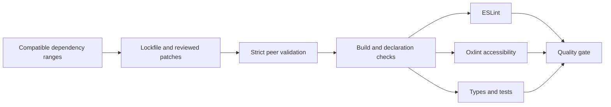

# ADR 061: Dependency updates and strict validation

- Date: 2026-09-17
- Status: Accepted (upstream constraints documented below)

## Current status (2026-10-06)

Unresolved findings below describe dated historical snapshots. ADR 062 removed the node-forge/braces dependency paths, and PR #265 is merged with zero dependency audit findings. Three CodeQL transport-boundary alerts and major migrations remain in the [execution plan](../implementation_plans/20261006-maintenance-and-roadmap.md).

## Context

Broad overrides held dependencies back. Permissive peer rules, skipped declaration checking, and successful lint runs with warnings obscured incompatibilities.

## Decision

- Update direct dependencies to stable releases and replace unnecessary exact versions with compatible ranges. Retain the lockfile for reproducible installation.
- Remove blanket overrides for Vue internals, API Extractor, Babel, and other dependencies. Retain audited security floors for vulnerable minimatch, ajv, lodash, and esbuild ranges, plus the TypeScript ESLint utils compatibility update used by the TSDoc plugin and the scoped Nitro/Archiver migration below.
- Enable strict peer validation. Move the existing accessibility rules to Oxlint so ESLint 10 remains supported without allowing mismatched peers. Preserve previously enabled accessibility checks and enable the focus rule.
- Fail lint on warnings. Upload SARIF after lint failures without converting the lint result into success.
- Check declaration files and remove deprecated compiler options instead of suppressing diagnostics. Resolve workspace packages through their public declarations. Normalize Vue declarations to public Vue imports and NodeNext-compatible paths.
- Replace lucide-vue-next with its official successor, @lucide/vue. Migrate benchmarks to Vitest 5 context fixtures and JSON reporting.

## Compatibility constraints

- TypeScript remains at ^6.0.3. TypeScript 7.0 lacks the legacy compiler API and is outside the supported ranges of typescript-eslint and TypeDoc. See the [official announcement](https://devblogs.microsoft.com/typescript/announcing-typescript-7-0/).
- Unicorn remains at ^64.0.0. Adopting version 75's recommended rules also entails ES2024/2025 APIs and broad implementation changes. That migration is separate from this update, which retains ES2022 compatibility.
- Migrate Nitro's Azure ZIP output to Archiver 8's `ZipArchive` API with a targeted patch and `nitropack>archiver` override. This removes deprecated archiver-utils/glob 10. Actual archive generation/extraction and a regression test verify compatibility.

## Upstream compatibility patches

These patches correct specific declaration and API defects rather than disabling checks. Revalidate and remove each patch when its upstream package fixes the issue.

| Package                                                        | Correction                                                               |
| -------------------------------------------------------------- | ------------------------------------------------------------------------ |
| tsup                                                           | Do not inject deprecated baseUrl when no value was configured            |
| rapid-draughts                                                 | Add extensions to relative ESM declaration imports                       |
| @storybook/react / @storybook/vue3 / @storybook/web-components | Align meta and story constraints under strict optional-property checking |
| @storybook/react-vite                                          | Infer docgen options for both CommonJS and ESM import shapes             |
| storybook                                                      | Add the ESM extension to the testing-library type import                 |
| @testing-library/jest-dom                                      | Match Vitest 5 Assertion type parameters and asynchronous return types   |
| nitropack                                                      | Migrate Azure ZIP output to Archiver 8 ZipArchive                        |

## Validation

Validate lint, type checking, the complete build, tests, Core coverage, benchmarks, dependency audit, and public declaration resolution. Do not record failed or unexecuted checks as successful.

### Validation paths

- Published-resource SRI fetch failures and unreadable documentation metadata exit nonzero without an opt-in environment variable. Four regression tests cover failure propagation, Vue declaration rewriting, and Nitro ZIP generation.
- `lint:tooling` explicitly checks the changed helper scripts. Staged-file lint selects files within ESLint's configured scope and treats warnings as failures.
- Configure the Tailwind 4 PostCSS plugin in Next.js to eliminate the unprocessed `@theme` CSS warning.
- Remove blanket `continue-on-error` from documentation artifact downloads. Missing optional, unpublished artifacts retain an explicit warning; transport and authentication errors propagate as failures.

### Measurements on 2026-09-17

- `pnpm install --frozen-lockfile`: passed with strict peer validation.
- `pnpm lint`: 98/98 tasks passed; accessibility and helper scripts also passed without warnings.
- `pnpm typecheck`: 99/99 tasks passed, including dependency declarations.
- `pnpm build`: SRI fetching and 56/56 tasks passed without build warnings.
- `pnpm test`: 1,661 tests in 146 files passed, plus three tooling regression tests.
- Core coverage: lines 98.45%, statements 97.94%, branches 89.05%, functions 94.4%; all configured thresholds passed.
- `pnpm audit`: zero findings at every severity. Only TypeScript and Unicorn remain in `pnpm outdated -r`, for the reasons above.
- Repository-wide ESLint also passed without warnings. CI explicitly allocates a 4 GB heap. JS parser configuration now specifies its root directory, generated API documentation is excluded, and Registry has an explicit lint script.
- CodeRabbit reviewed packages and scripts separately. Its Windows path-handling finding was fixed and regression tests rerun. The service returned `completed_with_warnings`; this is not treated as complete external approval of every change.
- E2E and publication/deployment were not run.

- Benchmarks: all 19 passed without warnings in an isolated rerun (219.66 seconds). The initial run overlapped builds and had one 60-second timeout; it was not counted as a pass.

### Browser validation and fixes (2026-09-18)

- Use the current Portless `apps` configuration and named URLs. E2E builds production output before starting the server and stops it with SIGINT afterwards. Local unprivileged runs explicitly set `PORTLESS_PORT=1355`.
- Fail E2E on browser console warnings/errors and unhandled exceptions. All four React and five Vue dashboard tests passed.
- Initialize dashboard positions from their actual FEN/SFEN. Vue piece-name and symbol maps default to empty objects both when omitted and when cleared, preventing Web Component rendering exceptions.
- Treat typed `SEARCH_ABORTED` errors as normal search cancellation. Other search/stop failures propagate to callers and appear in the UI. Return the stop Promise to prevent unhandled rejections.
- Use the Playwright CT package's CLI and remove redundant `@playwright/test` dependencies that selected a mismatched runner version.

### Integration review and additional validation (2026-09-26–27)

- Integrate compatible updates from Dependabot #250 / #251 / #255, adopting Next.js 16.3.5, Vitest 5.0.2, Vue 3.5.43, and ESLint 10.11.0. Defer the TypeScript 7 and Unicorn major migrations under the compatibility constraints above. Node 26 declarations are also outside this change, which is validated on Node.js 24.
- Adopt the OSV Scanner Action commit from #254 and correct its version annotation to v2.6.0.
- CodeRabbit's first packages review detected stale failures after engine replacement. Its second review detected older operations overwriting the latest operation's error on the same engine. Both React and Vue now check engine identity and the latest command; regression tests cover replacement and delayed rejections after stopping.
- The scripts review detected Vue declaration rewriting affecting ordinary string literals. Restrict rewriting to module specifiers in `from` / `import()` syntax and add a regression assertion preserving string literals. The second scripts review reported zero findings, as did the examples and .github reviews.
- `pnpm lint` / `pnpm typecheck` / `pnpm build` / `pnpm test` all exited 0. Unit tests passed in 148 files with 1,678 tests, plus four tooling tests. Repository-wide ESLint and doc-sync also passed.
- Core coverage: lines 98.45%, statements 97.94%, branches 89.05%, functions 94.4%. Thresholds were not changed.
- `pnpm install --frozen-lockfile` passed. The updated `pnpm audit` reported zero findings at every severity after the update.
- The initial benchmark run failed when excessive samples exhausted the worker heap. Standardize each case on 1,000 warmup iterations and 10,000 measured iterations; all 19 passed without increasing the heap or suppressing failures. These results use a different sampling regime from the old time-based runs and are not directly compared with historical performance numbers.
- Browser E2E passed: React CT 64, Vue CT 57, React dashboard 4, Vue dashboard 5. Dashboard console warnings/errors and unhandled exceptions were absent.
- A Nuxt plugin timing warning appeared once during concurrent builds and did not recur in the standalone E2E build. Unset `NO_COLOR` in the validation environment to resolve its conflict with Playwright's `FORCE_COLOR`; all 130 E2E tests passed again without warnings.
- Pre-commit validation after patch reinstallation detected import-x failing to resolve its TypeScript parser. Declare `@typescript-eslint/parser` as a direct development dependency instead of relying on transitive package placement.

### Continued dependency updates (2026-10-01)

- Integrate artifact download action v25 from Dependabot #258 and compatible dependency updates from #260.
- Upgrade Wrangler to obtain undici 7.29.1 and update serialize-javascript to a patched release within its existing dependency range. Add no new overrides or audit exclusions.
- TypeScript 7 remains outside the latest typescript-eslint / TypeDoc peer ranges. Unicorn 76 triggers numerous additional rule violations in existing CI and remains a separate migration while this update retains ES2022. Node 26 type definitions also remain deferred to match the Node 24 validation environment.

### Continued dependency updates (2026-10-04)

- The October 2 Dependabot failures were caused by `minimumReleaseAge` rejecting the React ESLint plugin released 36 hours earlier and the Next.js ESLint plugin released 35 hours earlier. They do not establish defects in the reported Node types, Unicorn, or TypeScript updates. No release-age exclusions are added.
- GitHub does not allow retrying this Dependabot run. Compatible dependencies are therefore updated locally and resolution is revalidated with strict peer dependency checks.
- TypeScript 7 remains outside typescript-eslint's `>=4.8.4 <6.1.0` peer range and TypeDoc's support through `6.0.x`. Unicorn 77 and Node 26 types require separate verification. Storybook is updated to 10.6.1 with five existing patches reapplied. Development dependency devalue is updated within its existing allowed range. The npm audit reports no patched versions for node-forge and braces; these remain unresolved. No audit exclusions or new overrides are added.

- Unresolved development dependencies: [node-forge](https://github.com/advisories/GHSA-86w9-cpqp-85rv) and [braces](https://github.com/advisories/GHSA-vfj7-8cjw-p6xm). The failing full `pnpm audit` is not reported as passing.

- Final validation: `pnpm build` passed 56/56 tasks and `pnpm typecheck` passed 99/99 tasks. `pnpm lint`, `pnpm test`, frozen-lockfile installation, and doc-sync passed. CodeRabbit dependency and additional patch reviews each completed with zero findings. Production audit found no vulnerabilities; the full audit retains the two high-severity findings above. E2E, remote CI, and publication have not been performed.

### 2026-10-05: Replace dependencies without patched releases

Replace the consuming paths for node-forge and braces. See [ADR 062](062-development-tooling-security-backends.md) for the decision and maintenance procedure.
