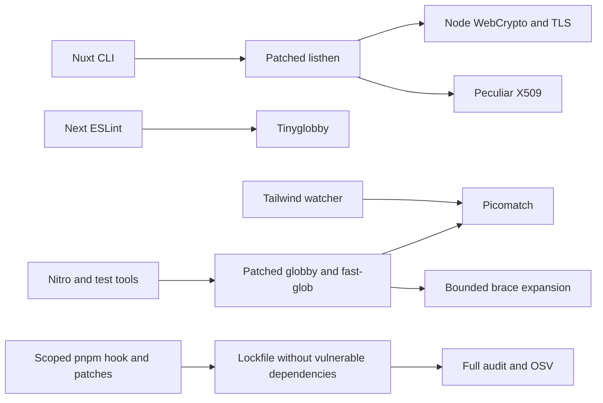

# ADR 062: Replace cryptography and glob dependencies in development tooling

- Date: 2026-10-05
- Status: Accepted

## Context

PR #262's OSV audit detected node-forge 1.4.0 and braces 3.0.3, with no patched releases. Although these are transitive development dependencies, they fail the full dependency audit. Waiting for an upstream release alone does not finish the remediation, so the consuming implementations are migrated while preserving required functionality.

## Decision

- Move listhen 1.10.1 certificate handling to Node.js WebCrypto/TLS and @peculiar/x509. Apply the change to both CJS and ESM, retaining certificate chains, DNS/IP SANs, encrypted PEM, and PFX. Give the CA and server certificates distinct names and key identifiers. Pass PFX directly to Node TLS; the listener certificate type becomes a PEM/PFX union.
- Move Next ESLint plugin 16.3.8 root discovery to tinyglobby, preserving absolute/relative path and trailing separator behavior.
- Move matching in fast-glob 3.3.3, globby 16.2.4, and @parcel/watcher 2.5.1 to picomatch. Use @isaacs/brace-expansion for fast-glob expansion and preserve escapes. Explicitly reject input beyond 65,536 characters, 64 nesting levels, 256 brace groups, or 10,000 expansions. Never silently truncate results.
- Combine implementation patches with dependency changes in .pnpmfile.cjs scoped to exact package names and reviewed versions. Patches alone do not alter the resolved dependency graph; the hook removes unused dependencies and declares the replacements actually used. Replacement dependencies retain compatible version ranges, while patches target reviewed package versions.
- Do not exclude findings, convert audit/OSV failures into success, or rename vulnerable packages. A regression test verifies that node-forge, braces, and micromatch are absent from the lockfile.

## Validation and maintenance

scripts/tooling-security.test.mjs exercises the installed CJS/ESM HTTPS servers, TLS requests trusting the generated CA, encrypted PEM/PFX, incorrect passwords, glob discovery and ignores, ranges/escaping/excessive expansion, and watcher ignore patterns. PFX test data is generated temporarily using system OpenSSL. No private keys or fixed credentials are stored in the repository.

Revalidate patches and the hook together during upstream updates. Remove both once upstream provides a safe implementation. Bridge communication, SRI, and public APIs remain unchanged. Record validation in the PR; do not report failed or unperformed checks as passing.

## References

- [node-forge advisory](https://github.com/advisories/GHSA-86w9-cpqp-85rv)
- [braces advisory](https://github.com/advisories/GHSA-vfj7-8cjw-p6xm)
- [Peculiar X509](https://github.com/PeculiarVentures/x509)
- [Tinyglobby](https://github.com/SuperchupuDev/tinyglobby)
- [Brace expansion](https://github.com/isaacs/brace-expansion)

2026-10-06: Address five newly reported vulnerabilities using vulnerable-range overrides for simple-git >=4.0.1 <5, @simple-git/argv-parser >=2.0.1 <3, and source-map-js >=1.2.2 <2. Update the Nuxt DevTools 3.4.2 Git factory import to its named export and verify branch/revparse/status compatibility. Remove these overrides and the patch once upstream adopts secure dependency ranges.
