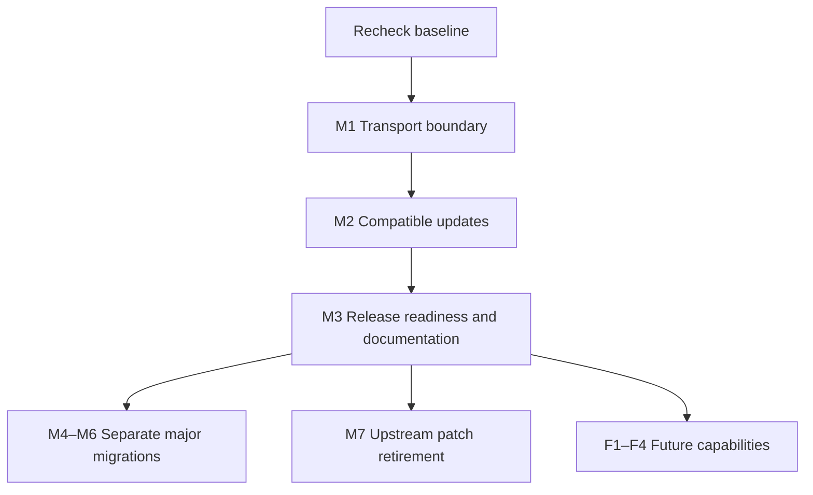

# Maintenance and remaining-work plan (2026-10-06)

## Baseline and scope

Baseline: main `9c4aff7`, verified on 2026-10-06 at 15:50 JST. Recheck versions, alerts, branches, and publication state before implementation. PRs #262 and #265 are merged. Main CI, E2E, ESLint, benchmarks, Pages deployment, and SRI refresh succeeded. There are no open PRs/issues or running/queued Actions. npm audit and Dependabot report zero findings; CodeQL still has three open High alerts. Release found no unpublished packages and did not publish new versions.

Outdated output has 15 rows representing 14 distinct packages: eleven routine updates and three separate major migrations. Preserve `.gemini/settings.json` and `.serena/project.yml` changes outside maintenance PRs.

## Execution order and acceptance criteria

| ID  | Priority | Work / delivery unit                                     | Prerequisite                                                  | Completion criteria                                                         |
| --- | -------- | -------------------------------------------------------- | ------------------------------------------------------------- | --------------------------------------------------------------------------- |
| M1  | P0       | ChunkedDownloader transport boundary / dedicated PR      | Public API, callers, local development requirements           | Regression tests, full gates, alerts 68–70 resolved on latest main          |
| M2  | P1       | Eleven routine dependency updates / compatible update PR | Stable versions, release-age policy, peer/runtime constraints | Gates, E2E, zero npm/OSV findings; record deferred updates                  |
| M3  | P1       | Release readiness and documentation                      | Actual publication targets                                    | Distinguish workflow success from publishing; document unknown token expiry |
| M4  | P2       | TypeScript 7 / migration PR                              | Official typescript-eslint and TypeDoc support                | Types, declarations, API docs and gates pass without suppression            |
| M5  | P2       | Unicorn 77 / migration PR                                | Rule changes and ES2022 policy                                | Fix violations and pass gates in supported environments                     |
| M6  | P2       | Node 26 types / migration PR                             | Supported Node runtime decision                               | Types and runtime aligned, gates pass                                       |
| M7  | P2       | Patch/override retirement / upstream-specific PRs        | Secure upstream implementation and compatibility              | Frozen install, regression tests, zero audit findings after removal         |
| F1  | P3       | Real KataGo model                                        | URL, licence, retrieval and distribution design               | Replace stub, verify SRI and real inference, confirm deployment             |
| F2  | P3       | Real Mortal model                                        | PyTorch-to-ONNX conversion and Worker contract                | Replace rule-based stub, verify SRI and real inference                      |
| F3  | P3       | Cloudflare CDN                                           | Account, R2, domain, distribution policy                      | Verify delivery, CORS, SRI and rollback                                     |
| F4  | P3       | WebNN/WebGPU and Mobile/Hybrid                           | Requirements, environments, performance targets               | Separate ADR and implementation plan before execution                       |

Execute M1 then M2 and establish release readiness in M3. M4–M7 proceed separately when prerequisites are met. Future capabilities remain separate from maintenance completion. Commit to dates after investigation of scope and external prerequisites.

## M1 investigation and verification

CodeQL [68](https://github.com/hdkz-dev/multi-game-engines/security/code-scanning/68), [69](https://github.com/hdkz-dev/multi-game-engines/security/code-scanning/69), and [70](https://github.com/hdkz-dev/multi-game-engines/security/code-scanning/70) target the HEAD, Range, and single-fetch paths in `packages/core/src/storage/ChunkedDownloader.ts` (`js/insecure-download`). The implementation fetches the supplied URL directly and makes SRI optional.

- Determine HTTPS, URL credentials, redirect, and permitted local-development policies from public callers. Review the direct API contract against mandatory-SRI requirements.
- Reject invalid input before network access using the existing security-error conventions. Prevent redirect bypasses and apply the same policy to every fetch path.
- Preserve cache, cancellation, progress, and Range response contracts. Test unsafe/invalid URLs, redirects, SRI mismatch, valid HTTPS, cache, and cancellation.
- Verify alert resolution with analysis of the latest commit. Suppression or dismissal alone is not completion. Record evidence if a finding is suspected to be a false positive.
- Synchronize Japanese/English architecture, specifications, roadmap, and the relevant ADR for design changes.

## Dependency and upstream tracking

Routine candidates: @eslint-react/eslint-plugin, @radix-ui/react-separator, @typescript-eslint/parser, @vitejs/plugin-react, postcss, typescript-eslint, vite, @cloudflare/workers-types, @radix-ui/react-scroll-area, @radix-ui/react-slot, and oxlint. This is a dated candidate list, not an instruction to adopt every version without validation.

Prefer compatible ranges and avoid unnecessary pinning. Check release age, peers, and Node requirements. Keep TypeScript, Unicorn, and Node types in separate migrations. Retire security overrides and ADR 062 patches only after both upstream security and compatibility are verified.

## Release, documentation, and future-capability constraints

- Release ended with `No unpublished projects to publish.` This does not prove npm write credentials are valid. Check permissions and expiry before actual publication without displaying secrets. NPM_TOKEN was last updated on 2026-07-31; current expiry is unknown.
- KataGo and Mortal assets return HTTP 200 with registered SRI. Both are stubs. KATAGO_ONNX_URL is absent; stub build jobs exist. Serving assets is separate from production-model readiness.
- Correct outdated 404/missing-job statements and place current progress above historical snapshots. Reconcile completion marks against implementation and tests. The ensemble strategy provides fixed weights; phase-specific expert mapping remains unverified.
- Specify targets, expected changes, and recovery before external deployments or publication. Never put secret values in logs or documents.

## Shared delivery checklist

1. Recheck main, working tree, PRs, and alerts; preserve unrelated settings.
2. Prepare relevant tests, bilingual documents, and ADRs.
3. Before committing, pass `pnpm lint && pnpm typecheck && pnpm build && pnpm test`, doc-sync, audits, and relevant E2E.
4. Follow AI_WORKFLOW, address verified review findings, and validate CI for the latest PR HEAD.
5. Merge using a merge commit; check authorization for admin merge.
6. Verify post-merge CI, publication, alerts, main synchronization, and branch cleanup. Report anything unverified.

## History

- 2026-10-06: Plan created. M1–M7 and F1–F4 implementation has not started. Documentation organization is in progress; this is not completion of M3 operational checks.
