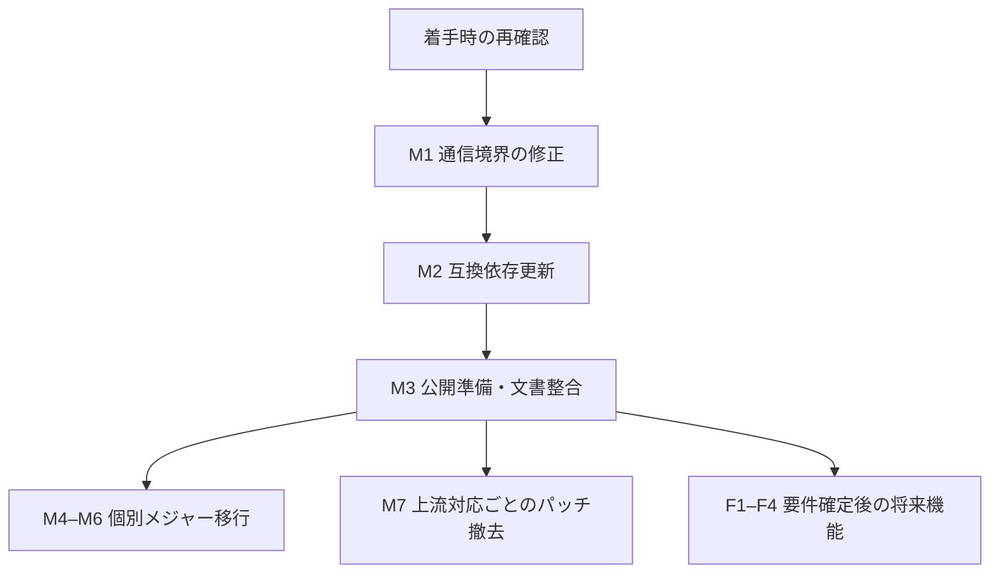

# 保守・残作業の実行計画 (2026-10-06)

## 1. 目的と確認基準

依存更新の完了とプロジェクト全体の未完了を区別し、安全性、互換性、公開状態を順に改善する。確認基準は main `9c4aff7`、2026-10-06 15:50 JST の読み取り調査。件数・公開バージョン・警告は着手時に再確認する。

| 項目                                   | 確認結果                                        | 扱い                     |
| -------------------------------------- | ----------------------------------------------- | ------------------------ |
| PR #262 / #265                         | merge commit で統合済み                         | 完了                     |
| main / ローカル                        | 同一コミット、作業ブランチ整理済み              | 完了                     |
| 最新main CI・E2E・ESLint・ベンチマーク | 成功                                            | 完了                     |
| Pages・SRI更新                         | 成功                                            | 完了                     |
| Release                                | 成功、未公開パッケージなし                      | 新規npm公開とは区別      |
| 未処理PR・Issue・実行中・待機中Actions | すべて0件                                       | 状況確認のみ             |
| pnpm audit / Dependabot                | 0件                                             | 依存監査の結果           |
| CodeQL                                 | High 3件、最新mainに存在                        | 最優先の残件             |
| outdated                               | 14種類（表示15行）、うちメジャー移行3種類       | 再解決・互換検証が必要   |
| 個人設定変更                           | `.gemini/settings.json` / `.serena/project.yml` | 保持し、保守PRに含めない |

## 2. 順序・実施単位・完了条件

| ID  | 優先度 | 作業 / 実施単位                            | 前提                                        | 完了条件                                        |
| --- | ------ | ------------------------------------------ | ------------------------------------------- | ----------------------------------------------- |
| M1  | P0     | ChunkedDownloaderの安全な通信境界 / 専用PR | 呼び出し元・公開API・ローカル開発要件の調査 | 回帰検証、全ゲート、最新mainの警告68–70解消     |
| M2  | P1     | 通常依存11種類の更新 / 互換更新PR          | 着手日の安定版と公開待機ポリシー確認        | 全ゲート、E2E、OSV/npm監査0、保留理由記録       |
| M3  | P1     | 公開準備と状況文書の整合 / 文書・運用確認  | 実際の公開予定と変更対象の確認              | 期限不明を明記、npm公開とワークフロー成功を区別 |
| M4  | P2     | TypeScript 7 / 専用移行PR                  | typescript-eslint・TypeDoc等の正式対応      | 型・宣言・API文書・全ゲート成功、抑制なし       |
| M5  | P2     | Unicorn 77 / 専用移行PR                    | 規則差分とES2022対応方針                    | 違反を根本修正、対象環境で全ゲート成功          |
| M6  | P2     | Node型定義26 / 専用移行PR                  | 対応Node実行環境の決定                      | 実行環境・型の整合、対応環境で全ゲート成功      |
| M7  | P2     | パッチ・override撤去 / 上流対応ごとのPR    | 修正版が利用可能、実装互換性確認            | 除去後に監査0、凍結インストール・回帰検証成功   |
| F1  | P3     | KataGo本番モデル                           | モデルURL、ライセンス、取得・配信方法の決定 | スタブ置換、SRI、実モデル推論テスト、公開確認   |
| F2  | P3     | Mortal本番モデル                           | PyTorch→ONNX変換とWorker仕様                | ルールベーススタブ置換、SRI、実モデル検証       |
| F3  | P3     | Cloudflare CDN                             | アカウント、R2、ドメイン、配信方針          | 配信・CORS・SRI・ロールバック確認               |
| F4  | P3     | WebNN/WebGPU、Mobile/Hybrid                | 要件・対応環境・性能基準の決定              | 個別ADRと実装計画で合意後に実施                 |

M1→M2を先に実施し、M3で公開準備を確定する。M4–M7は前提が満たされた項目から独立して進める。将来機能は保守完了とは別に管理する。日付の確約は外部前提と変更規模の調査後に行う。

## 3. M1の調査・設計・検証

対象は `packages/core/src/storage/ChunkedDownloader.ts` のHEAD・Range・単一fetch。CodeQL [68](https://github.com/hdkz-dev/multi-game-engines/security/code-scanning/68)、[69](https://github.com/hdkz-dev/multi-game-engines/security/code-scanning/69)、[70](https://github.com/hdkz-dev/multi-game-engines/security/code-scanning/70) は `js/insecure-download`。現実装ではURLを直接fetchし、SRIはオプション。

- 公開APIと利用経路を調べ、HTTPS・URL資格情報・リダイレクト・許可するローカル開発URLの方針を決定する。SRI必須方針と直接利用時の契約も確認する。
- 不正入力はネットワークアクセス前に例外で拒否する。既存のセキュリティエラー型と方針を再利用する。リダイレクトによる検証回避も対象に含める。
- HEAD・Range・単一fetchで同じ方針を適用し、キャッシュ、中断、進捗、Range応答の契約を維持する。
- HTTP等の拒否、無効URL、リダイレクト、SRI不一致、正常HTTPS、キャッシュ、中断の意味のあるテストを追加する。
- 抑制や警告のdismissだけで完了にしない。最新コミットのCodeQL解析で対象警告の解消を確認する。誤検出が疑われる場合も根拠を記録して判断する。
- 設計変更はARCHITECTURE・TECHNICAL_SPECS・ROADMAPの日本語/英語、ADRに同期する。

## 4. 依存更新とパッチの整理

通常更新候補11種類は @eslint-react/eslint-plugin、@radix-ui/react-separator、@typescript-eslint/parser、@vitejs/plugin-react、postcss、typescript-eslint、vite、@cloudflare/workers-types、@radix-ui/react-scroll-area、@radix-ui/react-slot、oxlint。これは調査時点の候補であり、全てを未検証で採用する指定ではない。

既存の互換範囲を優先し、不要な固定を増やさない。公開待機・peer・Node条件を確認し、採用不可のものは理由を残す。simple-git系、source-map-js等のセキュリティoverrideと、ADR 062の暗号・globパッチは上流の安全性と互換性の両方を確認してから除去する。TypeScript、Unicorn、Node型定義は通常更新に混在させない。

## 5. 公開・文書・将来機能の注意点

- Release成功だけではnpm書き込み認証の有効性は実証されない。今回は `No unpublished projects to publish.`。次回の実公開前に権限・期限を秘密の内容を表示せず確認する。NPM_TOKENのsecret最終更新は2026-07-31、現在の期限は未確認。
- KataGo/MortalのPages URLはHTTP 200、SRI登録済み。KataGoはスタブONNX、MortalはルールベースWorker。KATAGO_ONNX_URL secretは未登録。配信完了と本番AIモデル完成を分ける。
- ROADMAPの古い404・ジョブ未存在記載を訂正する。PROGRESSの過去スナップショットは履歴として残し、現在の状況を冒頭に置く。
- Swarmは固定重み付き戦略とテストを確認した。序盤・終盤特化の動的Expert Mappingは未確認の残件としてROADMAPを訂正した。Build Pipelineやその他の完了マークも実装・テストを根拠に検証する。
- CDN、モデル、本番公開などの外部操作は対象・変更結果・復旧手順を具体化してから実施判断する。秘密値をログや文書へ書かない。

## 6. 全PR共通の完了条件

1. mainの最新状態、作業ツリー、PR、警告を確認し、個人設定変更を保持する。
2. 変更と対応するテスト・日英ドキュメント・必要なADRを揃える。
3. コミット前に `pnpm lint && pnpm typecheck && pnpm build && pnpm test`、doc-sync、監査、変更に対応するE2Eを成功させる。
4. AI_WORKFLOWに沿ってレビュー指摘を検証・修正し、PRの最新HEADのCIを確認する。
5. merge commitで統合する。管理者マージは許可の範囲を確認する。
6. マージ後CI、公開処理、警告、main同期、作業ブランチ整理を確認する。省略・未確認事項を最終報告に明記する。

## 7. 対応履歴

- 2026-10-06: 実行計画作成。M1–M7 / F1–F4は未着手。状況文書と計画を整理済み。M3の文書整合は進行中で、公開認証等の運用確認は未完了。
